# User Manual for LIBRA

## 1) Build and Run

This section explains the procedure of building and deploying LIBRA from the github source files.

There will be many code snippets that explains the building process. each snippet has the following format:

- First the github repository has to be obtained.

~~~bash
$ git clone https://github.com/projectlibra/projectlibra.git
~~~

- Once you clone the repository, you will encounter a file structure like the following:

~~~bash
/projectlibra
├── README.md
├── libra-backend
└── libra-frontend
~~~

### Building the Client

The client is written in React JS and the build procedure is fairly simple.

#### Install React JS

If React JS is not currently installed on your system, we consult you to the [official React JS documentation](https://reactjs.org/docs/create-a-new-react-app.html) for the installation process.

#### Install dependencies

You can install all dependencies required for the client using the following snippet:

~~~bash
$ cd libra-frontend
$ npm install
~~~

#### Setting up the HOST IP

You must change the host IP embedded in the file **host.js** for the backend server that you are running:

~~~bash
var host = 'Backend Server IP:PORT'
~~~

#### Runnning the client

You can run the client via npm and the landing page will be displayed in the default browser:

~~~bash
$ npm start
~~~

### Building the Server

Since the server has many dependencies in Python, we suggest using a virtual environment:

~~~bash
$ pip install virtualenv
$ virtualenv libra
$ source libra/bin/activate
# For deactivating virtualenv
$ deactivate
~~~

#### Installing dependencies

~~~bash
$ cd libra-backend
$ pip install -r requirements.txt
~~~

#### Setting up a PostgreSQL Server

We consult you to [PostgreSQL server setup tutorial](https://www.digitalocean.com/community/tutorials/how-to-install-and-use-postgresql-on-ubuntu-18-04) from digitalocean.

After the setup, the configuration line under **app.py** has to be changed with the following information:

~~~
postgres://user_name:password@db_server_ip:port/db_name
~~~

#### Setting up SnpEff

We consult you to [SnpEff installation manual](http://snpeff.sourceforge.net/SnpEff_manual.html) 

In addition to the installation procedure, we need GRCh38.86 database.

~~~bash
$ java -jar snpEff.jar download -v GRCh38.86
~~~

#### Running the Server

The following will run the back-end server with the specified **PORT** on the server's IP address accepting all connections.

~~~bash
$ cd libra-backend
$ flask run --host 0.0.0.0 --port PORT
~~~

## 2) Usage of LIBRA: Registration and Profile
### Homepage
This is the landing page potential users will be greeted with when they click on our website on a web browser. Visitors can proceed to sign in or sign up by pressing the sign in button in the navigation bar on top.

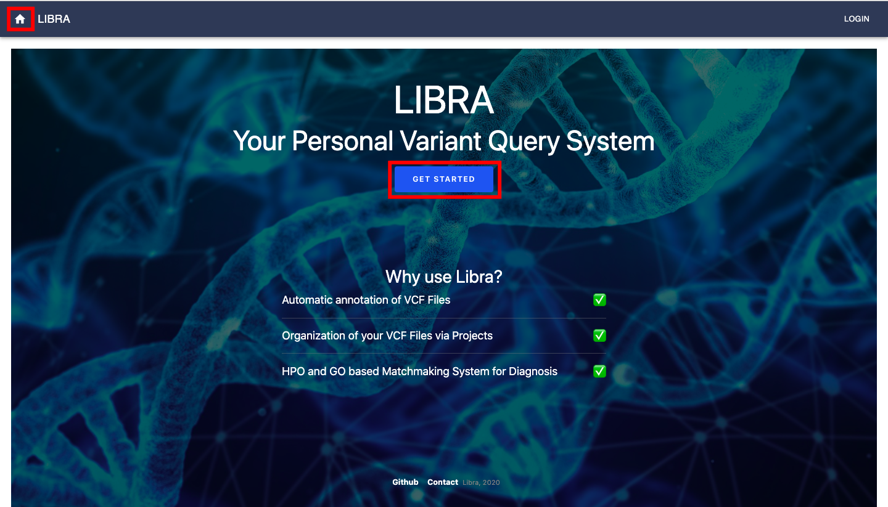

### Sign Up
In this page, to create a new users visitors will have to fill in the required input fields. These fields are username, name, email address, password and password confirmation. After clicking sign up, users will be redirected to the index page to login their accounts.

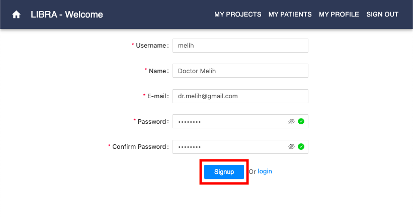

### Login
In this page visitors will be presented with two options: If the visitor has an account they can proceed to log in by entering their username and password or if they do not have an account they can choose to create one by clicking on the sign up button.

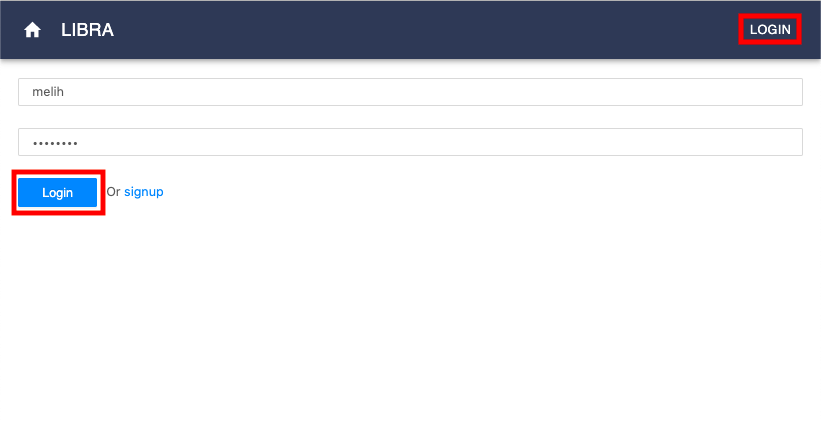

## 3) Usage of LIBRA: VCF Upload, Annotation and Filtering
### My Projects
After logging in, users will be directed to the projects page. In this page they will have one project by default for quick start on a random project. Additionally, users can create their custom projects. When they press the "Create New Project" button, a dialog will pop up which will ask the user to fill in the Project Name, Project Description and optionally the disease associated with the project.

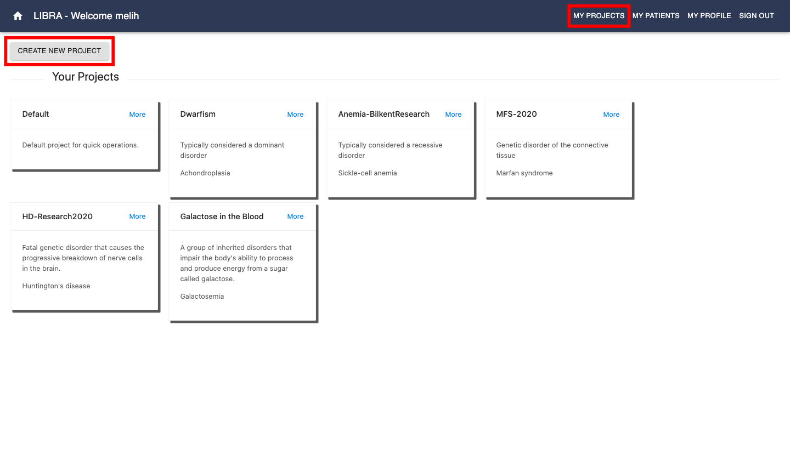

### Create a New Project
By clicking "CREATE NEW PROJECT" button, the user can create a new project with its description and associated disease.

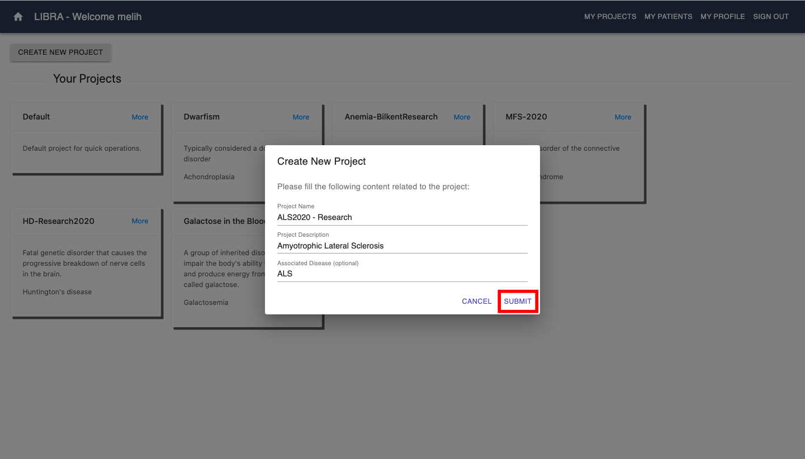

### Project Details
By clicking "More" at the top right corner of the project box, the user can redirect to project details page
On the right side of this page, there is a menu that contains summary, upload, notes and patients items.

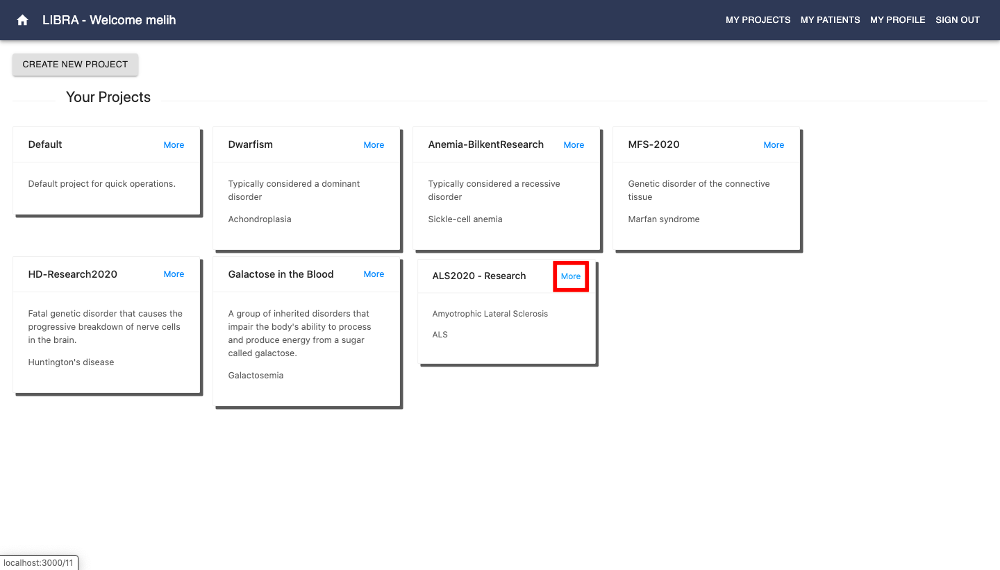

#### Project summary
User is redirected to this page after clicking on a specific project on the "Projects Page." User will first be presented the VCF table. If there are no VCF files uploaded to the project instead of seeing the VCF table the user will see "You haven't uploaded any files yet." If there is a VCF file uploaded to the project, however, they will see two pie charts indicating the presence of variants in the 1000 Genomes and dbsnp databases, the annotated VCF file presented in a table and a filter to select certain tuples of the VCF table based on frequency, scenario and impact of the variants.

Because of the immense size of VCF files, initially only 1000 elements of the table will be uploaded to the UI. The user can select to add another 1000 tuples to UI table by pressing on the "Load More" button. They can repeat this operation as many times as they want until the entire file is uploaded to the UI. 

To the left of the VCF table there are three filters. These filters are scenario, frequency and impact filters. Users can select the options presented in the filters and when they are done selecting the options they can press on the "Apply Filters" button to view tuples on the VCF table that fit into the selected options. The scenario filters select dominant or recessive variants. Frequency filter selects tuples in dbsnp or 1k Genome database. Impact filters select tuples with high, moderate, low or modifier putative impacts. Scenario and frequency filters are radio button groups, so, the user will be able to only pick one of the options presented there for each filter. Impact filter is a checkbox group, so, the user can select a combination of the impacts.
#### VCF upload
This page is where the user uploads the VCF files. On the top of the page there is a dropdown menu that has the options none, batch upload or specific patients. Below that is the dropzone for the file upload. The users can drag and drop one or more VCF files into the dropzone. Based on the option selected on the dropdown menu the upload procedure will work differently. 
 
 If the user selected none option ...
 
 If the user selected the batch upload option...
 
 If the user selected a specific patient ...
 
 After the files are successfully uploaded the annotation process will take place in the backend and the users will be unable to interact with the dropzone.

#### Project Notes

#### ProjectPatients

## 4) Usage of LIBRA: Match Maker

Match maker contains facilities which are creating a patient with diagnosis and human phenotype ontology(HPO) terms, showing over all view for patients, detailed view for a patient,  getting gene ontology similarity from VCF annotation,  HPO traverser, automated similarity notification system, manual similarity notification system, similarity threshold configuration.

### Create New Patient

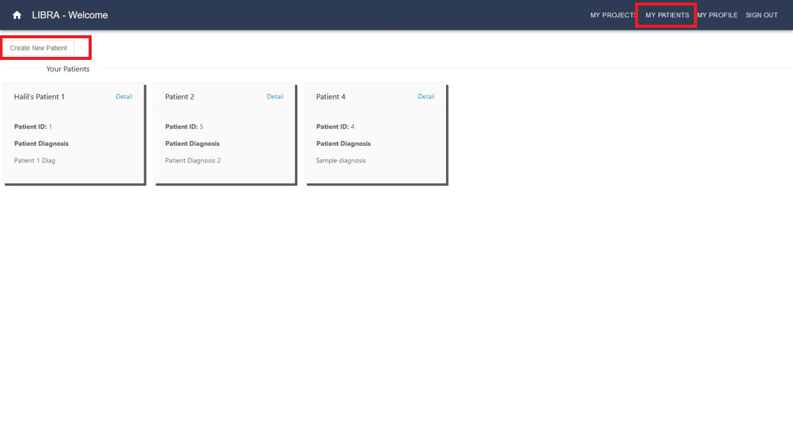

To create a new patient click "My Project" button on the navigator. After that, press "Create New Patient" button. Fill "Patient Name" and "Diagnosis".  Type HPO Tags via search bar and select from dropdown menu. You can delete tags by pressing "Clean Tags" button. After adding all phenotypes, click "Create" button. 

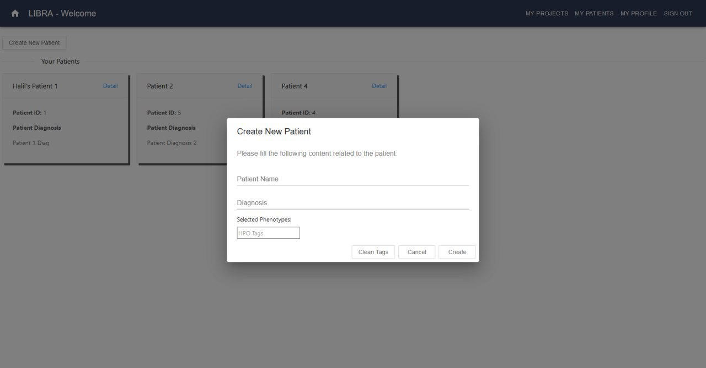

### See Overall View for Patients

Click "My Project" button on the navigator. Below of the  "Your Patient", you see all patients. For each patient you see patient name, patient id and patient diagnosis.

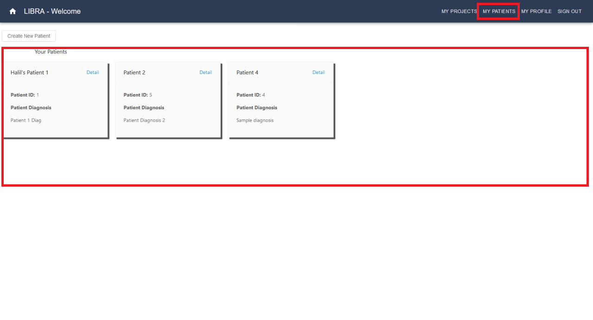

### See Details for a Patient

On the overall view for patient, click detail button of correspondent patient. You will see same information with preview. Also you will see disease related phenotypes and affected gene names. If you click a phenotype, you can see details of phenotype and traverse on phenotypes. If you click gene name, you are redirected to gene information.

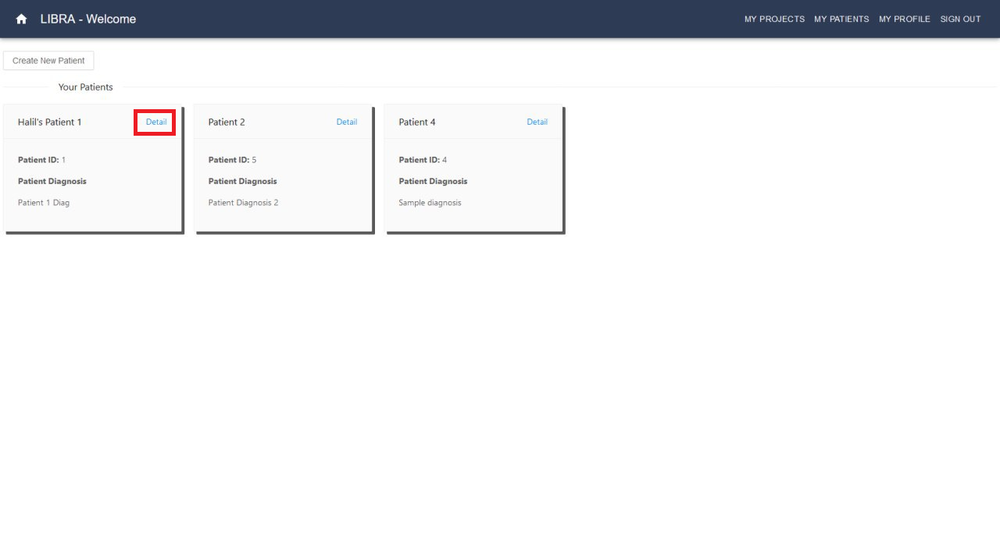

### Editing a Patient

On the detailed Patient page, click "Edit Patient" button. You can give new name to the patient. You can change diagnosis via text box. You can add new phenotype via search bar. Also you can remove phenotypes by uncheck the checkbox of corresponded phenotype.

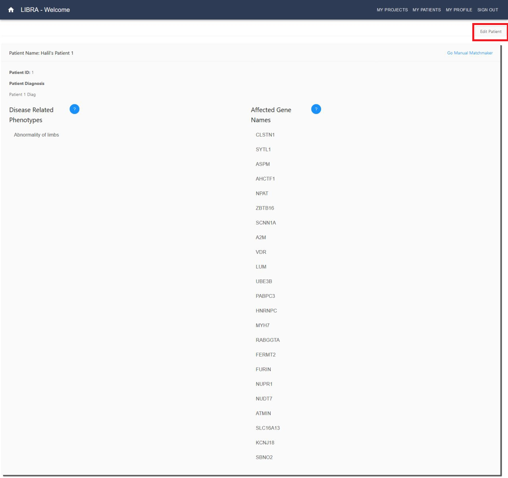

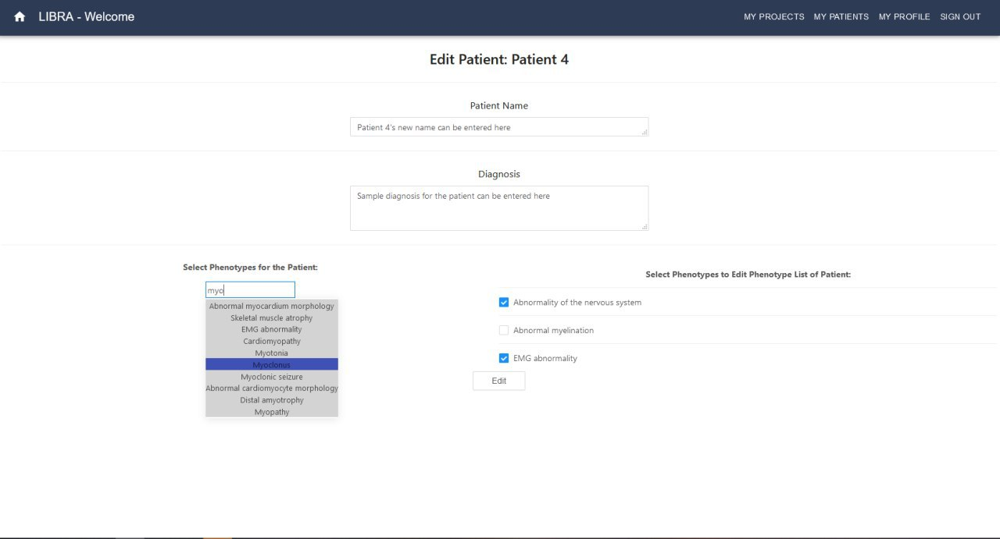

### Get Highly Affected Genes For a Patient 

After uploading the vcf file, click patient logo. Select name of the patient. Automatically highly affected genes will be added to the patient.

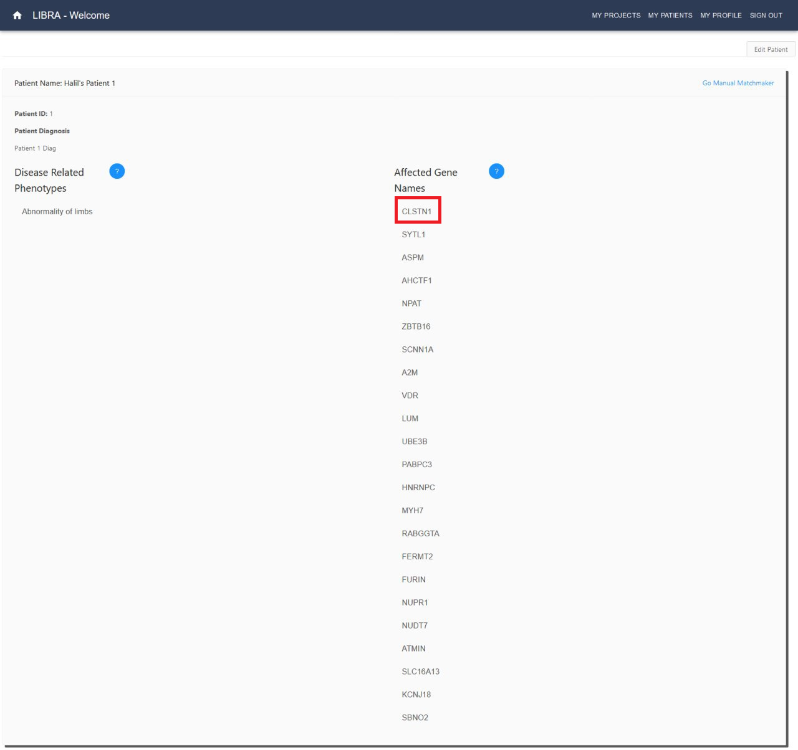

### HPO traverser

When you click phenotype name on the detailed patient page, you will be directed to the HPO traverser. On the traverser, you will see name of the phenotype, definition of the phenotype and relative phenotypes. You can traverse parents and children by clicking name of that phenotype. 

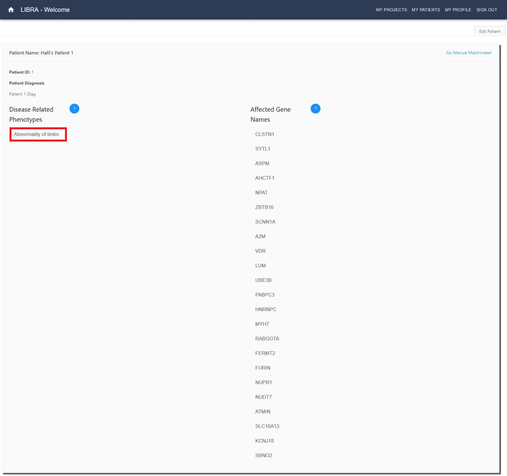

### Automated Similarity Notification System

According to the threshold, if there is similar patient to the your patient, you will automatically get an e-mail which inform you about contact info of doctor who has similar patient. Also e-mail indicates both HPO similarity and GO similarity.  

### Manual Similarity System

On  the detailed Patient page, click "Go Manual Matchmaker" link. There are three different system to use. Firstly, you can choose some phenotypes and search patient for that phenotypes and click "Run Manual Matchmaker" button. It returns proper patients for the query. Secondly, you can list patients which are most similar to the patient according to phenotype by clicking "Run HPO Matchmaker". Finally,  you can list patients which are most similar to the patient according to affected gene  by clicking "Run GO Matchmaker".

### Similarity Threshold Configuration

Click "My Profile" button on the navigator. After that, enter value between 0 and 1 for both "Phenotype Similarity Threshold" and "Genotype Similarity Threshold". Click "Save Changes". New configuration affects Automated Similarity Notification System.

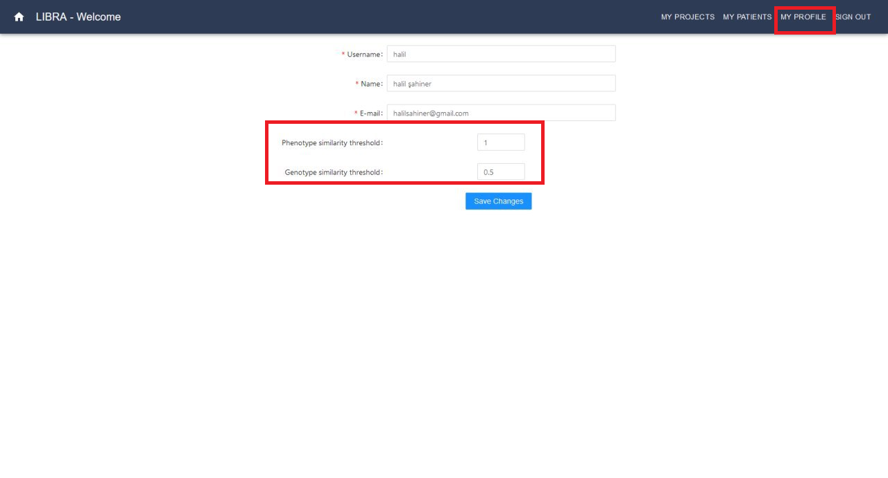
